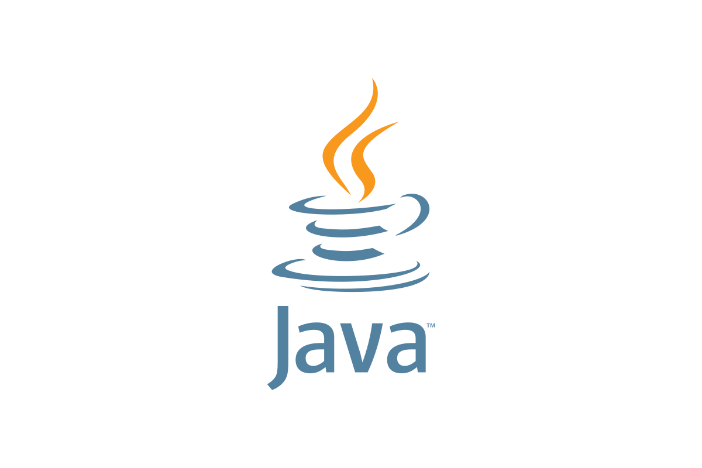
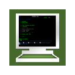

# Stephane0614
# Bienvenue sur mon GitHub

## Qui suis-je ?

Je m'appelle Stéphane Nsimba. J'ai 38 ans. J'habite à St Romain la Virvée dans le nord Gironde.

Après plus de dix ans de métier dans les travaux public et ferroviaire en déplacement sur toute la France. J'ai exercé ce métier durant des années avec beaucoup de satisfaction. Mais l’exercice de cette profession devenait de plus en plus incompatible avec ma nouvelle vie de famille. J’ai donc décidé de me réorienter professionnellement. L'avantage de la reconversion, c’est la possibilité de repartir de zéro, tous les choix de carrière s’offraient à moi, j’ai donc décidé de suivre mes envies :

Je suis un passionné de technologie, de sciences, d’arts et de jeux vidéo. Il me semblait de plus en plus logique que je devais me tourner vers les métiers passionnants de l'informatique.

Je suis aujourd'hui titulaire du titre RNCP Niveau 5 (Bac +2) <b>Développeur web et web Mobile</b>.

Je travaille en local sur des petits projets pour me perfectionner et m'auto-former sur différentes technologies. J'ai passé en Parallèle une certification en ligne sur le moteur graphique Unity 3D pour la réalisation de jeu vidéo et Blender pour la modélisation 3D.

## Mes stacks

<!--  -->
        
 
     
 
 

## Mon softs

    

## Mes projets de stacks à étudier

  

## Mes stats

## Mes profils sociaux

